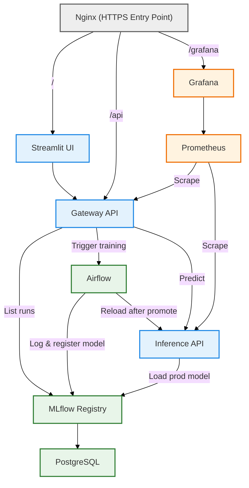

# MLOps Platform – Construction Cost Prediction

This project implements an end-to-end MLOps platform for the Solafune Construction Cost Prediction challenge.

The current production baseline is tabular-only.  
Image ingestion, validation and versioning are implemented to prepare for future multimodal modeling.

The objective is not only model performance, but the design of a reproducible, modular, production-oriented ML system covering the full lifecycle:
data ingestion → validation → training → promotion → serving → monitoring.

---

# Project Objectives

## Machine Learning

- Predict regional construction costs (tabular baseline)
- Prepare multimodal learning (satellite imagery pipeline ready)
- Track experiments reproducibly

## MLOps

- Modular microservice architecture
- Versioned configurations (feature / model / split)
- Data versioning with DVC
- Experiment tracking with MLflow
- Orchestrated pipelines with Airflow
- Secure model serving via FastAPI
- Reverse proxy entrypoint (Nginx)
- Monitoring with Prometheus & Grafana
- CI & automated testing

---

# Architecture Overview

The system is structured around clearly separated responsibilities:

⚫ **Entry Layer** → Nginx (HTTPS reverse proxy)  
🔵 **Serving Layer** → Streamlit (app), Gateway API, Inference API  
🟢 **Training Layer** → Airflow, MLflow, PostgreSQL  
🟠 **Monitoring Layer** → Prometheus, Grafana

## High-Level Service Diagram



---

# Live Deployment

# Live Deployment

The platform is deployed on an Oracle Cloud server and orchestrated with Kubernetes.  
It is publicly accessible at:

https://engineerai.space

The following routes are exposed:

- `/` → Streamlit application  
- `/api` → Gateway API  
- `/grafana` → Monitoring dashboards  

Authentication is required to access protected services.

The Streamlit application acts strictly as a frontend client of the Gateway API.  
It does not communicate directly with Airflow, MLflow, or the Inference service.  
All operational and inference requests pass through the Gateway layer.

---

# API Gateway

The API Gateway is the central orchestration layer of the platform.

All external interactions pass through the gateway.  
No internal service (Airflow, MLflow, Inference API) is exposed directly.

The gateway acts as:

- A control plane for ML operations  
- A secure abstraction layer over Airflow and MLflow  
- A single entry point for both UI and programmatic access  

Full interactive API documentation is available at https://engineerai.space/api/docs

---

# Prediction Flow

1. User interacts with Streamlit App
2. Request passes through Nginx (HTTPS)
3. Gateway authenticates, validates, and proxies the request
4. Inference API performs prediction
5. Model loaded from MLflow alias `prod`
6. Prediction returned to user

---

# Model Lifecycle

Model training, evaluation, promotion, and inference reload are fully automated through the Airflow orchestration layer.

The detailed lifecycle — including dataset splitting, MLflow tracking, DVC lineage logging, promotion logic, and registry alias management — is documented in:

- `docs/train_pipeline.md`
- `docs/data_pipeline.md`

This separation keeps the README focused on system architecture while maintaining detailed technical traceability in dedicated documentation.

---

# Repository Structure

```
mlops-project/

├── api/                           # FastAPI microservices
│   ├── gateway_api/               # API gateway (auth, orchestration)
│   └── inference_api/             # Model serving microservice
│
├── src/                           # Core ML business library (Python package)
│   ├── data/                      # Data ingestion & validation logic
│   ├── features/                  # Feature schema & preprocessing pipelines
│   ├── models/                    # Model schema & MLflow loader
│   ├── inference/                 # Dynamic request schema builder
│   ├── registry/                  # MLflow registry utilities
│   ├── splitting/                 # Train/test split orchestration
│   ├── pipelines/                 # Data & training pipelines (modular)
│   ├── training/                  # Metrics & training utilities
│   └── utils/                     # Config resolution, DVC, logging helpers
│
├── dags/                          # Airflow DAG definitions
│   ├── data_pipeline_dag.py
│   ├── train_pipeline_dag.py
│   └── retrain_policy_dag.py
│
├── configs/                       # Versioned YAML configurations
│   ├── active_config.yaml
│   ├── data_contracts/
│   ├── features/
│   ├── models/
│   └── splits/
│
├── app/                           # Streamlit dashboard (multi-page UI)
│
├── deployments/                   # Docker & Kubernetes manifests
│
├── data/                          # DVC versioned datasets
│   ├── incoming/
│   ├── raw/
│   ├── processed/
│   ├── splits/
│   └── reference/
│
├── tests/                         # Unit & integration tests
│
└── mlflow_server/                 # MLflow backend store & artifacts
```

---

# Evaluation Metrics

Primary metric:
- RMSLE (official Solafune metric)

Additional metrics:
- MAE
- R²

All metrics are logged in MLflow.

---

# Monitoring

- Prometheus scrapes API metrics
- Grafana provides dashboards
- Accessible via `/grafana` behind Nginx

---

# Deployment

Development:

```bash
docker compose -f deployments/compose.yaml -f deployments/compose.dev.yaml up
```

Production:

```bash
docker compose -f deployments/compose.yaml up -d
```

Environment variables managed via `.env`.

---

# Key MLOps Capabilities

- Versioned configuration system
- Model registry with aliasing
- Automated promotion logic
- Immediate model reload
- Data versioning with DVC
- Containerized microservices
- Observability stack
- Clear separation of concerns

---

This project demonstrates a clean, maintainable, production-oriented MLOps architecture, 
designed for internal ML platform usage rather than leaderboard optimization.