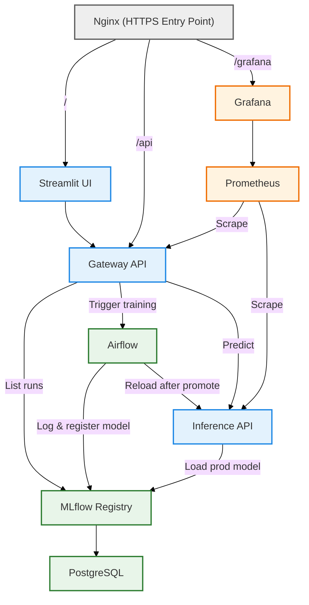

st.code(r"""
# MLOps – Construction Cost Prediction

## Solafune Challenge – Industrial ML Platform

This project implements an end-to-end MLOps platform for the Solafune Construction Cost Prediction challenge.

The current production baseline is tabular-only.  
Image ingestion, validation and versioning are implemented to prepare for future multimodal modeling.

The objective is not only model performance, but the design of a reproducible, modular, production-oriented ML system covering the full lifecycle:
data ingestion → validation → training → promotion → serving → monitoring.

---

# Project Objectives

## Machine Learning

- Predict regional construction costs (tabular baseline)
- Prepare multimodal learning (satellite imagery pipeline ready)
- Track experiments reproducibly

## MLOps

- Modular microservice architecture
- Versioned configurations (feature / model / split)
- Data versioning with DVC
- Experiment tracking with MLflow
- Orchestrated pipelines with Airflow
- Secure model serving via FastAPI
- Reverse proxy entrypoint (Nginx)
- Monitoring with Prometheus & Grafana
- CI & automated testing

---

# Architecture Overview

The system is structured around clearly separated responsibilities:

- <span style="color:#616161;">●</span> Entry Layer → Nginx (HTTPS reverse proxy)
- <span style="color:#1e88e5;">●</span> Serving Layer → Streamlit (app), Gateway API, Inference API
- <span style="color:#2e7d32;">●</span> Training Layer → Airflow, MLflow, PostgreSQL
- <span style="color:#ef6c00;">●</span> Monitoring Layer → Prometheus, Grafana

## High-Level Service Diagram



---

# Prediction Flow

1. User interacts with Streamlit App
2. Request passes through Nginx (HTTPS)
3. Gateway authenticates and proxies
4. Inference API performs prediction
5. Model loaded from MLflow alias `prod`
6. Prediction returned to user

---

# Model Lifecycle

1. Create or modify configuration (feature / model / split YAML)
2. Trigger training via Gateway → Airflow
3. Log metrics & artifacts in MLflow
4. Evaluate model performance
5. Promote if better (alias `prod`)
6. Airflow triggers `/reload` on Inference API
7. New model served immediately

Full traceability is ensured through:
- versioned configs
- MLflow params logging
- DVC data versioning

---

# Repository Structure

```
mlops-project/

├── api/                           # FastAPI microservices
│   ├── gateway_api/               # API gateway (auth, orchestration)
│   └── inference_api/             # Model serving microservice
│
├── src/                           # Core ML business library (Python package)
│   ├── data/                      # Data ingestion & validation logic
│   ├── features/                  # Feature schema & preprocessing pipelines
│   ├── models/                    # Model schema & MLflow loader
│   ├── inference/                 # Dynamic request schema builder
│   ├── registry/                  # MLflow registry utilities
│   ├── splitting/                 # Train/test split orchestration
│   ├── pipelines/                 # Data & training pipelines (modular)
│   ├── training/                  # Metrics & training utilities
│   └── utils/                     # Config resolution, DVC, logging helpers
│
├── dags/                          # Airflow DAG definitions
│   ├── data_pipeline_dag.py
│   ├── train_pipeline_dag.py
│   └── retrain_policy_dag.py
│
├── configs/                       # Versioned YAML configurations
│   ├── active_config.yaml
│   ├── data_contracts/
│   ├── features/
│   ├── models/
│   └── splits/
│
├── app/                           # Streamlit dashboard (multi-page UI)
│
├── deployments/                   # Docker & Kubernetes manifests
│
├── data/                          # DVC versioned datasets
│   ├── incoming/
│   ├── raw/
│   ├── processed/
│   ├── splits/
│   └── reference/
│
├── tests/                         # Unit & integration tests
│
└── mlflow_server/                 # MLflow backend store & artifacts
```

---

# Evaluation Metrics

Primary metric:
- RMSLE (official Solafune metric)

Additional metrics:
- MAE
- R²

All metrics are logged in MLflow.

---

# Monitoring

- Prometheus scrapes API metrics
- Grafana provides dashboards
- Accessible via `/grafana` behind Nginx

---

# Deployment

Development:

```bash
docker compose -f deployments/compose.yaml -f deployments/compose.dev.yaml up
```

Production:

```bash
docker compose -f deployments/compose.yaml up -d
```

Environment variables managed via `.env`.

---

# Key MLOps Capabilities

- Versioned configuration system
- Model registry with aliasing
- Automated promotion logic
- Immediate model reload
- Data versioning with DVC
- Containerized microservices
- Observability stack
- Clear separation of concerns

---

This project demonstrates a clean, maintainable, production-oriented MLOps architecture, 
designed for internal ML platform usage rather than leaderboard optimization.
""", language="markdown")