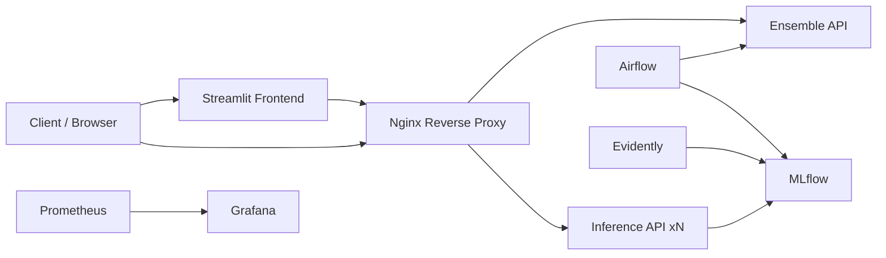

# MLOps – Construction Cost Prediction

## Multimodal Learning with Structured Data & Satellite Imagery (Solafune)

This project implements an end-to-end MLOps pipeline for the Construction Cost Prediction challenge (Solafune), combining structured tabular data and satellite imagery to predict construction costs.

Beyond model performance, the focus is on building a reproducible, scalable, and production-oriented machine learning system, covering the full lifecycle from data ingestion to monitoring and maintenance.

---

## Project Objectives

### Machine Learning Objectives

- Predict construction costs using structured tabular features and satellite images
- Build a robust multimodal baseline model
- Track and compare experiments reproducibly

### MLOps Objectives

- Design a modular and maintainable architecture
- Version data, models, and configurations
- Orchestrate workflows using Airflow
- Deploy models through FastAPI microservices
- Implement lightweight scalability
- Monitor model performance and data drift
- Automate testing and CI pipelines

---

## Evaluation Metrics

The primary evaluation metric is the Root Mean Squared Logarithmic Error (RMSLE), which is the official metric of the Solafune challenge.

RMSLE focuses on relative errors and is robust to large variations in construction costs.

Complementary metrics:

- MAE (Mean Absolute Error) for interpretability and business relevance
- R² (Coefficient of Determination) as a complementary diagnostic metric

All metrics are logged and tracked using MLflow.

---

## Project Structure

```text
mlops_project/
├── dags/
│ ├── ingestion_dag.py
│ ├── preprocess_dag.py
│ └── training_dag.py
│
├── src/
│ ├── data/
│ ├── models/
│ └── inference/
│
├── api/
│ ├── inference_api/
│ └── ensemble_api/
│
├── frontend/
│ └── streamlit_app.py
│
├── monitoring/
│ ├── prometheus/
│ ├── grafana/
│ └── evidently/
│
├── scripts/
├── data/
│ ├── raw/
│ └── processed/
│
├── models/
├── mlruns/
│
├── docker/
│ ├── nginx/
│ │ └── nginx.conf
│ ├── Dockerfile.airflow
│ ├── Dockerfile.mlflow
│ └── docker-compose.yml
│
├── configs/
│ └── params.yaml
│
├── pyproject.toml
├── uv.lock
├── .github/workflows/ci.yml
├── .env.example
├── README.md
└── .gitignore
```

---

## MLOps Pipeline Overview

### 1. Data Ingestion

- Detection of new datasets (structured data and satellite images)
- Schema and integrity validation
- Data versioning using DVC

### 2. Preprocessing & Feature Engineering

- Cleaning and encoding of structured features
- Image preprocessing (resizing, normalization)
- Construction of multimodal datasets

### 3. Model Training & Experiment Tracking

- Train / validation / test split
- Multimodal model training
- Experiment tracking with MLflow

### 4. Deployment & Serving

- FastAPI-based microservices
- Dockerized services
- Lightweight horizontal scalability using container replication
- Nginx reverse proxy as a single entry point

### 5. Monitoring & Maintenance

- System and API monitoring with Prometheus and Grafana
- Data and prediction drift detection using Evidently
- Support for automated retraining workflows

---

## Architecture Diagram (Mermaid)



---

## Services and Ports

Service Purpose Port Public
Nginx Reverse proxy / entry point 80 Yes
Frontend (Streamlit) Demo UI 8501 Optional
Airflow Orchestration UI 8080 Dev only
MLflow Experiment tracking 5000 Dev only
Prometheus Metrics scraping 9090 Dev only
Grafana Dashboards 3000 Dev only

Internal APIs are not exposed directly and are accessed only through Nginx.

---

## Testing Strategy

Unit tests cover:

- data validation and preprocessing
- model training and evaluation
- inference logic
- FastAPI endpoints

Tests are executed automatically via GitHub Actions.

---

## Running the Project

Clone the repository:

    git clone <repository_url>
    cd mlops_project

Configure environment variables:

    cp .env.example .env

Start all services:

    docker-compose up --build

---

## Dependency Management (uv)

This project uses uv for dependency management.

- Dependencies are defined in pyproject.toml
- Exact versions are locked in uv.lock
- Local virtual environments are excluded from version control

This ensures full reproducibility across local development, CI, and Docker environments.

---

## Tech Stack

- Python
- scikit-learn / PyTorch
- Airflow
- MLflow
- FastAPI
- Docker and Docker Compose
- Nginx
- Prometheus and Grafana
- Evidently
- DVC
- uv
- GitHub Actions

---

## Notes

Kubernetes is intentionally not used to keep the architecture lightweight and focused on core MLOps concepts.
The system is designed to be Kubernetes-ready, but Docker Compose and Nginx are sufficient for the project scope.

The goal is not to maximize leaderboard performance, but to demonstrate a clean, maintainable, and production-oriented MLOps architecture.

---

## License

This project is for educational and demonstration purposes.
