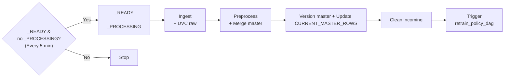
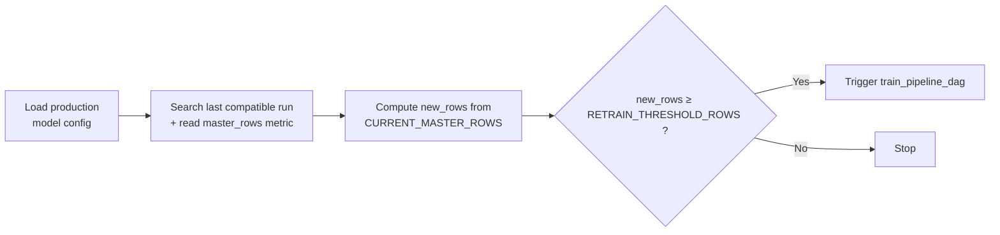

# Data Platform – Architecture & Retraining Strategy

## 1. Overview

This document describes the data orchestration layer of the platform.

The full platform includes:
- A data ingestion and preprocessing pipeline
- A retraining policy pipeline
- A training pipeline responsible for model training and logging

This documentation focuses on the data-driven orchestration logic, which is responsible for:

- Continuously ingesting and validating new data
- Maintaining a versioned master dataset
- Monitoring dataset growth
- Automatically deciding when model retraining is required

The data orchestration layer is composed of two Airflow DAGs:

- `data_pipeline_dag`: processes incoming batches end-to-end
- `retrain_policy_dag`: evaluates whether retraining should be triggered

The overall objective of this design is to ensure that:

- Data processing is deterministic and reproducible
- Dataset lineage is fully traceable (via DVC)
- Training decisions are driven by measurable data growth
- Model retraining occurs only when justified
---

## 2. Data Pipeline

The `data_pipeline_dag` runs every 5 minutes and processes at most one batch at a time.

### Execution Logic

1. **Gate / Lock**  
   The DAG checks for `_READY`.  
   If found, it renames it to `_PROCESSING` to ensure a single active batch.

2. **Ingestion**  
   Incoming tabular files and linked images are moved to a versioned raw batch directory.

3. **Raw Versioning (DVC)**  
   The raw batch is snapshotted with DVC to guarantee reproducibility.

4. **Preprocessing**  
   - Tabular data is validated against the active data contract  
   - Linked images are validated and canonicalized  
   - The batch is merged into the master dataset  
   - The master is written atomically  

5. **Master Versioning**  
   The updated `master.parquet` is versioned with DVC.  
   The Airflow variable `CURRENT_MASTER_ROWS` is updated.

6. **Cleanup & Trigger**  
   The lock is removed and the retrain policy DAG is triggered.

This pipeline guarantees:

- Exactly one active batch  
- Atomic master updates  
- Strict contract enforcement  
- Deterministic dataset lineage  

---

## 3. Retrain Policy

The `retrain_policy_dag` determines whether the model should be retrained.

### Decision Logic

1. The production model configuration is retrieved from MLflow.
2. The system searches for the last training run with the same:
   - feature version  
   - split version  
   - model version  
3. The metric `master_rows` from that run is compared to the variable `CURRENT_MASTER_ROWS`.
4. If the number of new rows exceeds `RETRAIN_THRESHOLD_ROWS` (a runtime-configurable Airflow variable), training is triggered.

This ensures that:

- Retraining is data-driven  
- Models are only retrained when justified  
- Model lineage remains fully traceable  

---

## 4. Design Principles

The platform follows strict MLOps principles:

- **Contract-driven validation**
- **Atomic dataset updates**
- **Full DVC versioning**
- **MLflow-based experiment tracking**
- **Automated, data-aware retraining**