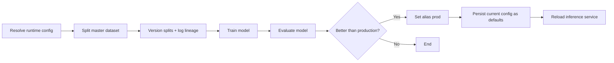

# Training Pipeline – Model Lifecycle & Promotion

The `train_pipeline_dag` manages the model lifecycle, from dataset splitting to conditional promotion in production.

It operates on the validated master dataset produced by the data pipeline.

The pipeline can be triggered automatically by the `retrain_policy_dag` or manually via the platform API. In both cases, it receives a runtime configuration containing:

- `split_version`
- `feature_version`
- `model_version`

Each training run is fully reproducible, versioned, evaluated, and traceable before any production update occurs.

---

## High-Level Flow

---

## Execution Logic

The pipeline begins by resolving the runtime configuration provided at trigger time.  
If versions are not explicitly passed, defaults are loaded from `active_config.yaml`.  
All requested versions are validated to ensure they are allowed and consistent before training starts.

A new MLflow run is then created. This run becomes the single source of truth for:

- Dataset statistics  
- Model parameters  
- Training and evaluation metrics  
- Dataset lineage  
- Promotion decision  
- Feature schema used  

The master dataset is loaded and split according to the specified `split_version`.  
This produces:

- A training dataset  
- A fixed reference dataset  
- Optional additional test datasets  

All datasets are written atomically. Split statistics such as row counts and duration are logged to MLflow.

The reference test dataset is created only if it does not already exist.  
If a reference dataset for the given `split_version` is already present, it is loaded and reused without being overwritten.  
This guarantees a stable evaluation baseline across training runs.

The generated splits are then versioned with DVC.  
Dataset hashes extracted from DVC metadata are logged into MLflow to ensure full reproducibility of the training context.

During training, the appropriate feature schema and model definition are loaded.  
The training dataframe is validated, features and targets are extracted, preprocessing is constructed, and the model is fitted.

The full preprocessing and model pipeline is stored as an MLflow artifact.

The model is then evaluated on the fixed reference dataset and any optional test datasets.

The reference evaluation metric (`reference_rmsle`) drives the promotion decision.

If the new model outperforms the current production model, the pipeline updates the MLflow Model Registry by setting the alias `prod` to the new version.

If the model does not outperform the current production model, the pipeline ends without modifying production.

When promotion occurs, the default versions in `active_config.yaml` are updated to reflect the promoted configuration.  
This ensures that future retraining cycles use the validated setup.

Finally, the pipeline attempts to notify the inference service through a `/reload` endpoint so that the production model is refreshed.  
This step is best-effort and does not cause the DAG to fail if the service is unavailable.

---

## Guarantees

The training pipeline guarantees:

- Deterministic dataset splitting  
- Immutable reference dataset  
- Full dataset lineage (DVC + MLflow)  
- Explicit, metric-based promotion  
- Registry-based production control  
- Safe production model updates  

Every promoted model is therefore:

- Reproducible  
- Traceable  
- Auditable  
- Data-validated  